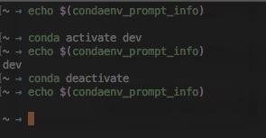

# zsh-condaenv

Plugin provides `condaenv_prompt_info` function which returns the current conda environment name.



## Installation

1. Download the plugin

   ```
   git clone https://github.com/saravanabalagi/condaenv $ZSH_CUSTOM/plugins/condaenv
   ```

1. Add to `plugins` in `.zshrc` file

   ```
   plugins=(my_plugins my_other_plugins condaenv)
   ```

Then launch a new terminal or source `.zshrc` in your current terminal.

## Usage

This plugin exposes:

- `condaenv_prompt_info` function based on two env vars
    1. `ZSH_THEME_CONDAENV_PREFIX` default `(`
    1. `ZSH_THEME_CONDAENV_SUFFIX` default `)`

Using this you can build a theme as below:

```zsh
base_prompt=PROMPT
PROMPT=$(condaenv_prompt_info)"$base_prompt"

ZSH_THEME_CONDAENV_PREFIX="%{$fg[blue]%}("
ZSH_THEME_CONDAENV_SUFFIX=")%{$reset_color%}"
```

## License

Please refer to the [License](LICENSE) file.
